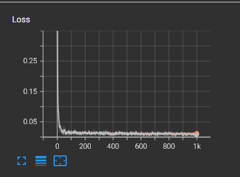
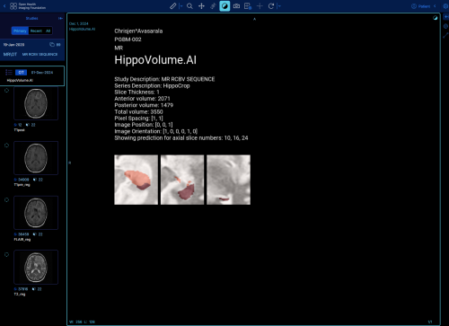

This algorithm, a "hippocampus segmentation/quantification" algorithm, is intended to assist radiologists and healthcare providers in the segmentation and quantification of the hippocampus in 3D MRI brain scans. It is intended to be used as a tool to aid in the diagnosis and monitoring of Alzheimer's disease progression. The algorithm is not intended to replace the expertise of a trained radiologist or healthcare provider, but to provide additional information to aid in the diagnostic process.

The algorithm is designed to be installed in a dedicated AI Server in a clinical setting, and must have connectivity to a PACS system.  The PACS system must be connected to the MRI scanner for retrieval of DICOM images, and must also be connected to a viewer such as OHIF for visualization of the segmentation results and other associated data.

The algorithm is intended for use in male and female patients between the ages of 15 to 100 suspected or confirmed of having Alzheimer's disease or other related neurodegenerative disorders where hippocampal volume changes are indicative of disease progression. 

The hardware requirements of the algorithm include a computing system with a minimum of 4 CPU cores, 16 GB ram, and a GPU to run. Note that it is not intended to be used on mobile devices, and adequate thermal cooling must be present to ensure the GPU does not overheat. It is strongly advised to perform regular maintenance and inspection of the computing system to ensure optimal performance.

The algorithm could have a significant clinical impact by providing a more accurate and consistent method for quantifying hippocampal volume in 3D MRI brain scans. This could lead to earlier detection of Alzheimer's disease and other neurodegenerative disorders, allowing for earlier intervention and treatment. It could also help in monitoring disease progression and response to treatment over time and reducing the workload of radiologists and healthcare providers.

The algorithm makes use of the U-Net architecture for segmentation of the hippocampus in 3D MRI brain scans. The U-Net architecture consists of an encoder-decoder network with skip connections that allow for the precise localization of the hippocampus in the input image. The architecture consists of 19 layers, including convolutional, max pooling, and up-sampling layers. The final layer is a convolutional layer with a sigmoid activation function that outputs the segmented hippocampus. 

A chart of the training loss over 1000 epochs is shown below:



For training and validation, the dataset used was retrieved from: http://medicaldecathlon.com/.  The original source of the data is Vanderbilt University Medical Center, and the original dataset was comprised of 394 mono-modal MRI brain scans. All data has been labeled and verified by an expert human rater, and with the best effort to mimic the accuracy required for clinical use.  For the related research paper, see: https://arxiv.org/abs/1902.09063

The training portion dataset used (after removing outliers) consisted of 260 3D MRI brain scans with labeled segmentations of the hippocampus. The dataset was split into 80% training and 20% validation sets. The images were in NIFTI format.

The validation dataset consisted of 40 3D MRI brain scans with manual segmentations of the hippocampus. The validation images were also in NIFTI format.

For training, performance of the algorithm was evaluated using the Dice similarity coefficient, the Jaccard index, and sensitivity.  The overall metrics are as follows:

```json
  "overall": {
    "mean_dice": 0.6211132378157918,
    "mean_jaccard": 0.825785223634155,
    "mean_sensitivity": 0.9948962684381328
  },
```

Explanation of metrics used:
- The Dice similarity coefficient (also known as F1 score) is defined as the intersection of the predicted and ground truth segmentations divided by the average of the predicted and ground truth segmentations. 
- The Jaccard index (also known as IoU) is defined as the intersection of the predicted and ground truth segmentations divided by the union of the predicted and ground truth segmentations. 
- Sensitivity is defined as the true positive rate, or the proportion of true positive predictions to the total number of positive cases.

No augmentations were used in the training set, but note that this could be a potential area for improvement in future iterations of the algorithm.  Possible augmentations include:
- Rotation
- Translation
- Scaling
- Horizontal Flipping
- Elastic deformations
- Intensity variations

An example of the algorithm output displayed in the OHIF viewer is shown below:



For further regulatory validation purposes, the ground truth segmentations of the hippocampus should be created by expert radiologists using a manual segmentation tool. The segmentations should be reviewed and verified by a consensus of multiple radiologists to create a silver standard ground truth.

Performance metrics used for real-world validation of the algorithm should focus on the Jaccard index and the Dice similarity coefficient. The algorithm should be evaluated on a validation dataset and compared to the previously established silver standard ground truth segmentations. 

Note that the algorithm will not perform well on the following types of images:
- Images with poor contrast
- Images with severe motion artifacts
- Images with severe noise
- Images with severe distortions
- Images of modalities other than MRI
- Images of body parts other than the brain
- Images belonging to patients not part of the intended use population